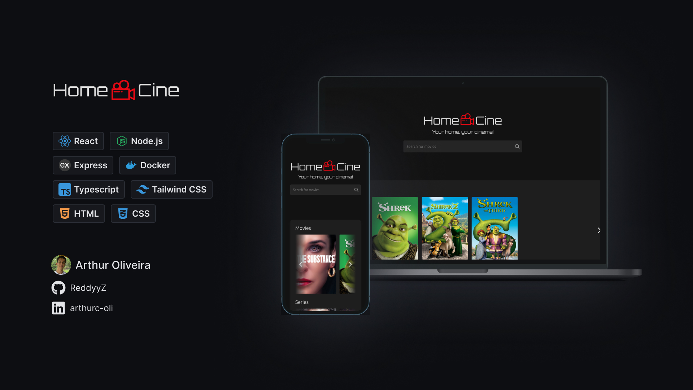

# :movie_camera: HomeCine - Media Server



## :pushpin: About the project

HomeCine is a streaming platform where you can upload and serve movies and series.

## :rocket: Features

- [x] Support for movies and series with multiple seasons/episodes
- [x] Admin panel
- [x] Fetch movie info from TMDB
- [ ] Subtitles support

## 🛠️ Technologies

- [Typescript](https://www.typescriptlang.org/)
- [React](https://react.dev/) + [Vite](https://vite.dev/)
- [Express](https://expressjs.com/pt-br/)
- [Nginx](https://nginx.org/)
- [Docker](https://www.docker.com/)

## :rocket: Running the project

Change the following enviroment variables on docker-compose.yaml and docker-compose.development.yaml

```
enviroment:
  ...
  - TMDB_API_KEY=MY_TMDB_API_KEY
  - JWT_PRIVATE_KEY=MySecretKey
  ...
  - ADMIN_USER=admin
  - ADMIN_PASSWORD=admin
```

[How to get TMDB API key](https://developer.themoviedb.org/docs/getting-started)

#### Development

```sh
docker compose -f docker-compose.development.yaml up -d --build
```

#### Production

```sh
docker compose up -d
```

## 📩 Contact

📧 **E-mail:** [arthur.reddyyz.contact@gmail.com](mailto:arthur.reddyyz.contact@gmail.com)

<a href="https://www.linkedin.com/in/arthurc-oli">
  
</a>
<a href="https://github.com/ReddyyZ">
  
</a>
<a href="https://reddyyz.github.io/portfolio">
  
</a>

---

Made with ❤️ by <a href="https://github.com/ReddyyZ">**Arthur Oliveira**</a> 🚀.
